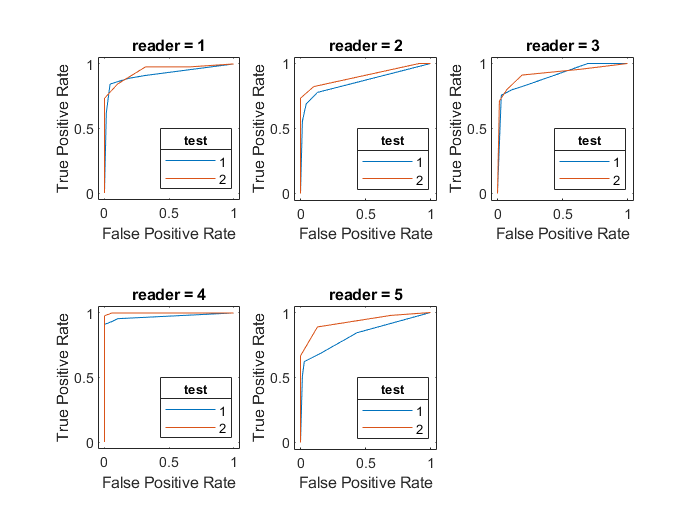

MRMCaov.m: Multi-Reader Multi-Case Analysis of Variance for MATLAB
================

## Description

The **MRMCaov** MATLAB toolbox enables statistical comparison of diagnostic tests - such as those based on medical imaging - for which ratings have been obtained from multiple readers and on multiple cases. Features of the package include the following.

-   Comparison of imaging modalities or diagnostic tests with respect to ROC metrics
-   ROC metrics include AUC, partial AUC, sensitivity, specificity, and
    expected utility as well as user-defined metrics
-   Empirical estimation and plotting of ROC curves
-   Support for factorial and nested study designs
-   DeLong, jackknife, and unbiased covariance estimation
-   Inference for random or fixed readers and cases
-   Compatibility with Microsoft Windows, Apple, and Linux

## Download and Installation

Download the latest release: [](https://github.com/brian-j-smith/MRMCaov.m/releases/latest)

Extract the downloaded files to a folder for the toolbox, navigate to the toolbox folder in the MATLAB Current Folder browser, and double click on the `MRMCaov.mltbx` file to install the toolbox.

## Citing the Software

    To cite MRMCaov in publications, please use the following reference, including the MATLAB toolbox URL.

    Smith BJ and Hillis SL (2022). _MCMCaov: Multi-Reader Multi-Case Analysis of Variance_. MATLAB toolbox version 0.2.0, <URL: https://github.com/brian-j-smith/MRMCaov.m>.

    @Manual{MRMCaov.m-toolbox,
    author = {Brian J Smith and Stephen L Hillis},
    title = {{MCMCaov}: Multi-Reader Multi-Case Analysis of Variance},
    year = {2022},
    note = {MATLAB toolbox version 0.2},
    url = {https://github.com/brian-j-smith/MRMCaov.m},
    }

## Example MRMC Analysis

```matlab
>> load VanDyke.mat
>> head(VanDyke, 8)

    reader    treatment    case    truth    rating    case2    case3
    ______    _________    ____    _____    ______    _____    _____

      1           1         1        0        1        1.1      1.1 
      1           2         1        0        3        1.1      2.1 
      2           1         1        0        2        2.1      1.1 
      2           2         1        0        3        2.1      2.1 
      3           1         1        0        2        3.1      1.1 
      3           2         1        0        2        3.1      2.1 
      4           1         1        0        1        4.1      1.1 
      4           2         1        0        2        4.1      2.1 


>> y = ROCAUCVariate(VanDyke.truth, VanDyke.rating);
>> fit = mrmc(y, VanDyke.treatment, VanDyke.reader, VanDyke.case,
              'cov', 'unbiased');
>> disp(fit)
    
ROCAUCVariate ANOVA data:

    reader    test       y        N 
    ______    ____    _______    ___

      1        1      0.91965    114
      1        2      0.94783    114
      2        1      0.85878    114
      2        2      0.90531    114
      3        1      0.90386    114
      3        2      0.92174    114
      4        1      0.97311    114
      4        2      0.99936    114
      5        1      0.82979    114
      5        2      0.92995    114 

Obuchowski-Rockette error variance and covariance estimates:

    Estimate     Correlation
   __________    ___________

Error    0.00078839          NaN  
Cov1     0.00034167      0.43338  
Cov2     0.00033906      0.43007  
Cov3     0.00023561      0.29885  


>> plot(fit)
```

```matlab

>> res = summary(fit);
>> disp(res)

Multi-Reader Multi-Case Analysis of Variance
Experimental design: factorial
Factor types: random readers and random cases
Response: ROCAUCVariate
Covariance method: unbiased
Confidence interval level: 95%

Obuchowski-Rockette variance component and covariance estimates:

                    Estimate     Correlation
                   __________    ___________

    reader          0.0015365          NaN  
    reader*test    0.00020776          NaN  
    Error          0.00078839          NaN  
    Cov1           0.00034167      0.43338  
    Cov2           0.00033906      0.43007  
    Cov3           0.00023561      0.29885   

ANOVA global statistical test of equal tests:

    MS(T)       MS(T:R)         Cov2          Cov3       Denominator      F       df1     df2      p-value 
  _________    __________    __________    __________    ___________    ______    ___    ______    ________

  0.0047962    0.00055103    0.00033906    0.00023561     0.0010683     4.4896     1     15.034    0.051162

Pairwise test differences:

  Comparison    Estimate     StdErr       df                CI                 t       p-value 
  __________    ________    ________    ______    ______________________    _______    ________

   "1 - 2"      -0.0438     0.020672    15.034    -0.087852    0.0002513    -2.1189    0.051162

Test means based only on the data for each one:

       Estimate      MS(R)         Cov2        StdErr       df              CI        
       ________    _________    __________    ________    ______    __________________

  1    0.89704     0.0030826    0.00047718    0.033071    12.588    0.82535    0.96872
  2    0.94084     0.0013046    0.00020095    0.021491    12.534    0.89423    0.98744 
```